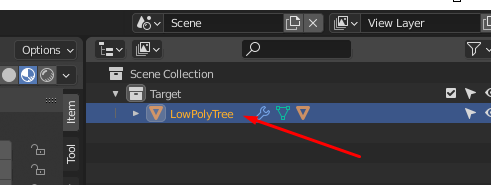
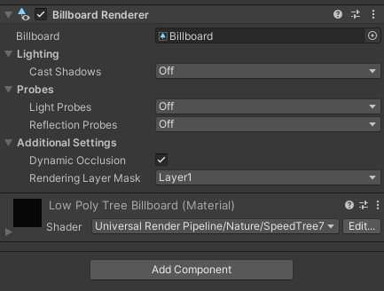

# UnityBillboardMaker
This is a Blender .blend file for generating Unity billboard assets and rendering the necessary textures.

## Usage

### Prepare the scene


Load the "Scene" scene.



Replace the LowPolyTree with your own objects. You can have as many objects here as you wish but you must make sure that they are all inside the "Target" collection, as this is what will be rendered.


In the World settings, adjust the strength of the environment light (making sure the viewport shading is set to "Rendered").


Billboards are rendered with uniform environment lighting. The rendered view should be flat with no shadows.

### Adjust the texture layout


Switch to the "RenderBillboard" scene. Switch to the "Billboard" tab.


Make sure to switch to camera view (keypad 0). You should see the objects you placed in the Target collection displayed in a grid, with each view showing a different angle.

By scaling the empty circle object in the bottom left corner of the grid, you can change the size of your objects.


Adjust this scale so that all the views fit nicely inside the white squares. Any geometry that appears outside of the squares will not be displayed in Unity.

If you really need to, you can adjust the position of the white frames (Tile.001 to Tile.009), but make sure to **only change the location and scale**. Do not edit the meshes directly.


You can also adjust the position of the objects in each tile.

### Adjust the billboard mesh


Once the geometry fits nicely in each frame, select the wireframe mesh that is seen above each frame and enter edit mode. Move the vertices so that, in every frame except the one at the lower left (top view), the geometry fits snuggly inside the mesh. The goal here is to make sure there are as few transparent pixels inside the mesh as possible. If needed, you can add faces. 


Keep in mind that the geometry is shared among all views. This can make adjustments difficult if you scene is very lopsided.

### Export the assets


Once this is done, in the "Output Properties" panel, set the texture resolution and the output folder. This is where all assets will be saved. 


In the code editor window displayed at the left of the "Billboard" tab, press the "Run Script" button to initiate export. If you do not see this button, adjust the size of the window. If no errors are displayed at the bottom of the script window, your assets are ready.

### In Unity


Copy the created asset and textures to your Unity assets.

You will need to create a new material for your billboard. Depending on the render pipeline you use, the material's shader will either be:

- Universal Render Pipeline: Universal Render Pipeline/Nature/SpeedTree7 Billboard
- Built-in: Nature/SpeedTree Billboard


Set the two textures as base RGB and normal maps.


Edit the Billboard asset so that it uses the newly created material. Here you can also change the size of the billboard, as well as the bottom position.

Create a new empty object and add a Billboard Renderer component. 



Set the Billboard parameter to your billboard asset, and the billboard should be correctly displayed.


### Troubleshooting


If the normals are not displayed properly in Unity, you may need to manually edit the material file. Open your billboard material file in a text editor and change the following line:

```YAML
m_ShaderKeywords: 
```

To:

```YAML
m_ShaderKeywords: BACKFACENORMALMODE_MIRROR EFFECT_BILLBOARD EFFECT_BUMP EFFECT_HUE_VARIATION
    _WINDQUALITY_FASTEST
```

Save the file and your normals should work properly.